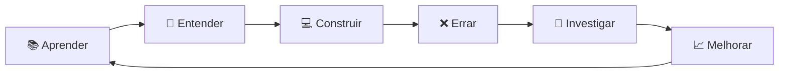

# Olá, eu sou o Gabriel 👋

### Desenvolvedor em formação • Tecnologia • Ciência • Matemática

<p>
  Gosto de entender como as coisas funcionam, transformar problemas em lógica e usar programação para construir soluções.
</p>

<p>
  Atualmente estou construindo minha base em desenvolvimento de software enquanto exploro áreas que conectam <strong>computação, matemática, dados e ciência</strong>.
</p>

---

## 🧭 Sobre mim

```text
curiosidade → estudo → experimentação → projetos → evolução
```

Não quero apenas aprender frameworks ou decorar sintaxe.

Quero entender os **fundamentos por trás da tecnologia**, escrever código melhor e, aos poucos, desenvolver projetos capazes de resolver problemas reais.

* 💻 Estudando **desenvolvimento de software**
* 🧠 Interessado em **algoritmos e estruturas de dados**
* ⚙️ Aprendendo **backend e APIs**
* 🐍 Explorando **Python e computação científica**
* 📐 Interesse em **matemática aplicada**
* 🤖 Curioso sobre **IA, automação e dados**
* 🔬 Fascinado pela interseção entre **ciência + computação**
* 🛠️ Construindo projetos para transformar conhecimento em prática

---

# 💻 Tecnologias

### Atualmente estudando e utilizando

<p align="left">


</p>

```javascript
const gabriel = {
  momento: "construindo minha base",

  estudando: [
    "JavaScript",
    "Node.js",
    "Python",
    "Backend",
    "APIs",
    "Banco de Dados",
    "Algoritmos",
    "Estruturas de Dados"
  ],

  interesses: [
    "Engenharia de Software",
    "Computação Científica",
    "Inteligência Artificial",
    "Matemática Aplicada",
    "Ciência"
  ],

  objetivo: "usar tecnologia para resolver problemas reais"
};
```

---

# 🔭 O que estou construindo

Minha jornada está concentrada em três pilares:

### 01 — Engenharia de Software

```text
JavaScript
     ↓
Node.js
     ↓
APIs REST
     ↓
Banco de Dados
     ↓
Arquitetura
     ↓
Testes
     ↓
Sistemas reais
```

Quero desenvolver uma base sólida para criar aplicações que não apenas funcionem, mas que sejam **organizadas, compreensíveis e sustentáveis**.

---

### 02 — Matemática + Computação

```text
Matemática
    +
Programação
    ↓
Modelagem
    ↓
Simulações
    ↓
Análise de dados
    ↓
Computação Científica
```

Tenho interesse especial em entender como programação pode ser utilizada para estudar fenômenos, criar modelos e resolver problemas quantitativos.

---

### 03 — IA aplicada

Não me interessa apenas utilizar IA como chatbot.

Quero aprender como integrá-la a sistemas para:

* automatizar processos;
* analisar informações;
* apoiar decisões;
* trabalhar com dados;
* construir ferramentas inteligentes;
* resolver tarefas repetitivas de empresas e pessoas.

---

# 🧪 Minha filosofia de aprendizado

> **Não quero apenas saber fazer. Quero entender por que funciona.**

Por isso tento seguir este ciclo:



---

# 🛠️ Projetos

Aqui você encontrará projetos que representam minha evolução.

Alguns serão simples.

Outros serão experimentos.

Outros podem se transformar em algo maior.

O objetivo é conseguir olhar para trás e enxergar claramente:

```text
onde comecei
      ↓
o que aprendi
      ↓
o que consegui construir
      ↓
como evoluí
```

### Tipos de projetos que pretendo desenvolver

* 🌐 aplicações web;
* ⚙️ APIs e sistemas backend;
* 📊 análise e visualização de dados;
* 🤖 automações com inteligência artificial;
* 🧮 algoritmos e matemática computacional;
* 🔬 simulações científicas;
* 🏢 soluções para problemas reais de empresas.

---

# 📚 Atualmente aprendendo/estudando...

```text
┌─────────────────────────────────────┐
│        SOFTWARE ENGINEERING         │
├─────────────────────────────────────┤
│ JavaScript                          │
│ Node.js                             │
│ APIs REST                           │
│ SQL                                 │
│ Git                                 │
│ Linux                               │
│ Algoritmos                          │
│ Estruturas de Dados                 │
└─────────────────────────────────────┘

                +

┌─────────────────────────────────────┐
│       MATEMÁTICA & CIÊNCIA          │
├─────────────────────────────────────┤
│ Matemática                          │
│ Probabilidade                       │
│ Estatística                         │
│ Álgebra Linear                      │
│ Métodos Numéricos                   │
│ Computação Científica               │
└─────────────────────────────────────┘
```

---

# 🎯 Para onde estou indo

No curto prazo:

**Fundamentos → projetos → experiência → primeira oportunidade**

No longo prazo, quero construir uma formação que combine:

```text
          COMPUTAÇÃO
              │
              │
   ┌──────────┴──────────┐
   │                     │
MATEMÁTICA             CIÊNCIA
   │                     │
   └──────────┬──────────┘
              │
              ▼
      RESOLUÇÃO DE
      PROBLEMAS REAIS
```

---

# 🌱 Status atual

```text
[████████░░░░░░░░░░░░] Construindo fundamentos
[██████░░░░░░░░░░░░░░] Construindo projetos
[████░░░░░░░░░░░░░░░░] Experiência profissional
[████████████████████] Curiosidade
```

Ainda estou no começo.

E esse é justamente o propósito deste GitHub:

**documentar a construção.**

---

<p align="center">
  <i>Aprendendo. Construindo. Experimentando. Evoluindo.</i>
</p>

<p align="center">
  🧠 + 💻 + 📐 + 🔬
</p>
