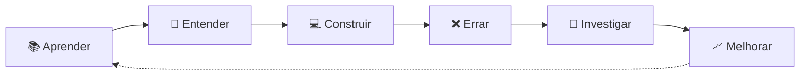

# Olá, eu sou o Gabriel 👋

### Desenvolvedor em formação • Tecnologia • Ciência • Matemática

Gosto de entender como as coisas funcionam, transformar problemas em lógica e usar programação para construir soluções.

Atualmente estou construindo minha base em desenvolvimento de software enquanto exploro áreas que conectam **computação, matemática, dados e ciência**.

---

## 🧭 Sobre mim

```text
curiosidade → estudo → experimentação → projetos → evolução
```

Não quero apenas aprender frameworks ou decorar sintaxe.

Quero entender os **fundamentos por trás da tecnologia**, escrever código melhor e, aos poucos, desenvolver projetos capazes de resolver problemas reais.

- 💻 Estudando **desenvolvimento de software**
- 🧠 Interessado em **algoritmos e estruturas de dados** & 📐 **matemática aplicada**
- ⚙️ Aprendendo **backend e APIs**
- 🐍 Explorando **Python e computação científica**
- 🤖 Curioso sobre **IA, automação e dados**
- 🔬 Fascinado pela interseção entre **ciência + computação**

---

## 💻 Tecnologias

### Stack atual

<p align="left">
  
  
  
  
  
  
</p>

| Tecnologia | Nível |
|---|---|
| HTML / CSS | Sei usar |
| Linux (terminal) | Básico |
| JavaScript | Intermediário → avançado |
| Node.js | Aprendendo |
| Python | Vou começar em breve |

```javascript
const gabriel = {
  momento: "construindo minha base",

  estudando: [
    "JavaScript",
    "Node.js",
    "Python",
    "Backend",
    "APIs",
    "Banco de Dados",
    "Algoritmos",
    "Estruturas de Dados",
  ],

  interesses: [
    "Engenharia de Software",
    "Computação Científica",
    "Inteligência Artificial",
    "Matemática Aplicada",
    "Ciência",
  ],

  objetivo: "usar tecnologia para resolver problemas",
};
```

---

## 🔭 O que estou construindo

Minha jornada está concentrada em três pilares:

### 01 — Engenharia de Software

```text
JavaScript → Node.js → APIs REST → Banco de Dados → Arquitetura → Testes → Sistemas reais
```

Quero desenvolver uma base sólida para criar aplicações que não apenas funcionem, mas que sejam **organizadas, compreensíveis e sustentáveis**.

### 02 — Matemática + Computação

```text
Matemática + Programação → Modelagem → Simulações → Análise de dados → Computação Científica
```

Tenho interesse especial em entender como a programação pode ser usada para estudar fenômenos, criar modelos e resolver problemas quantitativos.

### 03 — IA aplicada

Não me interessa apenas usar IA como chatbot. Quero aprender a integrá-la a sistemas para:

- automatizar processos;
- analisar informações;
- apoiar decisões;
- trabalhar com dados;
- construir ferramentas inteligentes;
- resolver tarefas repetitivas de empresas e pessoas.

---

## 🧪 Minha filosofia de aprendizado

> **Não quero apenas saber fazer. Quero entender como e por que funciona.**



---

## 🛠️ Projetos

Aqui você encontrará projetos que representam minha evolução — alguns simples, outros experimentais, e alguns que podem virar algo maior.

O objetivo é conseguir olhar para trás e enxergar claramente:

```text
onde comecei → o que aprendi → o que consegui construir → como evoluí
```

### Tipos de projetos que pretendo desenvolver

- 🌐 aplicações web
- ⚙️ APIs e sistemas backend
- 📊 análise e visualização de dados
- 🤖 automações com inteligência artificial
- 🧮 algoritmos e matemática computacional
- 🔬 simulações científicas
- 🏢 soluções para problemas reais

---

## 📚 Atualmente aprendendo

<table>
<tr>
<td valign="top">

**Software Engineering**
- JavaScript
- Node.js
- APIs REST
- SQL
- Git
- Linux
- Algoritmos
- Estruturas de Dados

</td>
<td valign="top">

**Matemática & Ciência**
- Matemática
- Probabilidade
- Estatística
- Álgebra Linear
- Métodos Numéricos
- Computação Científica

</td>
</tr>
</table>

---

## 🎯 Para onde penso em ir

**Curto prazo:** Fundamentos → projetos → experiência → primeira oportunidade

**Longo prazo:** construir uma formação que combine computação, matemática e ciência para a resolução de problemas reais.

```text
          COMPUTAÇÃO
              │
   ┌──────────┴──────────┐
   │                     │
MATEMÁTICA             CIÊNCIA
   │                     │
   └──────────┬──────────┘
              ▼
      RESOLUÇÃO DE
      PROBLEMAS REAIS
```

---

## 🌱 Status atual

`Fundamentos     ████████░░░░░░░░░░░░`
`Projetos        ██████░░░░░░░░░░░░░░`
`Experiência     ████░░░░░░░░░░░░░░░░`
`Curiosidade     ████████████████████`

Ainda estou no começo — e esse é justamente o propósito deste GitHub: **documentar a minha construção.**

<p align="center">
  <i>Aprendendo. Construindo. Experimentando. Evoluindo.</i>
</p>

<p align="center">
  🧠 + 💻 + 📐 + 🔬
</p>
