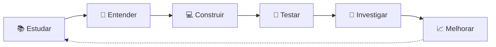

# Olá, eu sou o Gabriel 👋

### Desenvolvedor em formação • Software • Matemática • Ciência

<div style="inline-block">
  
</div>

Gosto de entender **como as coisas funcionam**, transformar problemas em lógica e usar programação para construir soluções.

Atualmente estou desenvolvendo minha base em **Engenharia de Software**, enquanto exploro áreas que conectam **computação, matemática, dados, inteligência artificial e ciência**.

```text
curiosidade → fundamentos → prática → projetos → evolução
```

---

## 🧭 Sobre mim

Minha prioridade não é apenas aprender frameworks ou decorar sintaxe.

Quero compreender os **fundamentos por trás da tecnologia**, desenvolver raciocínio computacional e aprender a construir software de forma cada vez mais organizada, eficiente e consciente.

Hoje, meus principais interesses estão em:

* 💻 **Engenharia de Software**
* ⚙️ **Backend e APIs**
* 🧠 **Algoritmos e Estruturas de Dados**
* 📐 **Matemática Aplicada**
* 🐍 **Python e Computação Científica**
* 🤖 **Inteligência Artificial e Automação**
* 🔬 **Computação aplicada à Ciência**

---

## 💻 Tecnologias

### Stack atual

<p align="left">
  
  &nbsp;
  
  &nbsp;
  
  &nbsp;
  
  &nbsp;
  
  &nbsp;
  
</p>

| Tecnologia           | Momento atual                       |
| :------------------- | :---------------------------------- |
| **JavaScript**       | Aprofundando conceitos avançados    |
| **HTML & CSS**       | Intermediário                       |
| **Node.js**          | 	Fundamentos de backend e APIs      |
| **Linux / Terminal** | Fundamentos/Básico                  |
| **Python**           | Primeiros passos                    |

Meu objetivo é priorizar fundamentos e projetos reais antes de simplesmente aumentar a quantidade de tecnologias no currículo.

---

## 👨‍💻 Em código

```javascript
const gabriel = {
  focoAtual: [
    "JavaScript",
    "Node.js",
    "Backend",
    "APIs REST",
    "Banco de Dados",
    "Algoritmos",
    "Estruturas de Dados",
  ],

  explorando: [
    "Python",
    "Computação Científica",
    "Inteligência Artificial",
    "Automação",
    "Matemática Aplicada",
  ],

  filosofia: "entender antes de abstrair",

  objetivo:
    "usar computação, matemática e ciência para resolver problemas reais",
};
```

---

## 🚀 Minha direção

Minha formação está sendo construída em três eixos principais.

### 01. Engenharia de Software

```text
JavaScript
    ↓
Node.js
    ↓
APIs REST
    ↓
Banco de Dados
    ↓
Arquitetura
    ↓
Testes
    ↓
Sistemas
```

Quero aprender a desenvolver aplicações que não apenas funcionem, mas que sejam **legíveis, organizadas, testáveis e sustentáveis**.

---

### 02. Matemática + Computação

```text
Matemática + Programação
           ↓
       Modelagem
           ↓
     Métodos Numéricos
           ↓
      Simulações
           ↓
 Computação Científica
```

Tenho interesse em usar programação como ferramenta para **modelar fenômenos, analisar dados, executar simulações e resolver problemas quantitativos**.

---

### 03. Inteligência Artificial aplicada

Meu interesse em IA vai além do uso de chatbots.

Quero entender como integrá-la a sistemas para:

* automatizar processos;
* analisar informações;
* trabalhar com dados;
* apoiar decisões;
* reduzir tarefas repetitivas;
* construir ferramentas inteligentes;
* resolver problemas reais de pessoas e empresas.

---

## 🧪 Como eu aprendo

> **Não quero apenas saber fazer. Quero entender como e por que funciona.**



Procuro transformar teoria em prática o mais rápido possível:

```text
conceito → exercício → implementação → erro → investigação → projeto
```

---

## 🛠️ O que você encontrará aqui

Este GitHub funciona também como um registro da minha evolução.

Aqui pretendo reunir projetos envolvendo:

* ⚙️ APIs e sistemas backend
* 🌐 aplicações web
* 🗄️ bancos de dados
* 🤖 automações com IA
* 📊 análise e visualização de dados
* 🧠 algoritmos e estruturas de dados
* 🧮 matemática computacional
* 🔬 simulações científicas
* 🏢 soluções para problemas reais

Algumas iniciativas serão apenas pequenos experimentos, enquanto outras se tornarão projetos completos. O fundamental, no entanto, é observar o aprendizado e a evolução em cada etapa:

```text
aprender → construir → receber feedback → refatorar → evoluir
```

---

## 📚 Atualmente estudando

<table>
<tr>
<td width="50%" valign="top">

### 💻 Software

* JavaScript
* Node.js
* Backend
* HTTP
* APIs REST
* SQL
* Git
* Linux
* Algoritmos
* Estruturas de Dados

</td>

<td width="50%" valign="top">

### 📐 Matemática & Ciência

* Matemática
* Álgebra Linear
* Probabilidade
* Estatística
* Métodos Numéricos
* Python científico
* Computação Científica
* Modelagem

</td>
</tr>
</table>

---

## 🎯 Para onde estou indo

### Curto prazo

```text
fundamentos → projetos → portfólio → experiência → primeira oportunidade
```

Quero construir uma base profissional sólida em desenvolvimento de software e transformar meus estudos em projetos demonstráveis.

### Longo prazo

Quero desenvolver uma formação na interseção entre:

```text
                 COMPUTAÇÃO
                     │
          ┌──────────┴──────────┐
          │                     │
     MATEMÁTICA              CIÊNCIA
          │                     │
          └──────────┬──────────┘
                     │
                     ▼
          MODELOS • SOFTWARE
          DADOS • SIMULAÇÕES
          AUTOMAÇÃO • PESQUISA
                     │
                     ▼
          PROBLEMAS DO MUNDO REAL
```

---

## 🌱 Momento atual

```text
Fundamentos      ███████████████░░░░░
Projetos         █████████░░░░░░░░░░░
Experiência      ████░░░░░░░░░░░░░░░░
Curiosidade      █████████████████████
```

Ainda estou construindo minha trajetória.

E esse é justamente o propósito deste perfil:

> **documentar o processo, transformar conhecimento em projetos e evoluir um pouco a cada versão.**

---

<p align="center">
  <strong>Aprender • Entender • Construir • Evoluir</strong>
</p>

<p align="center">
  🧠 &nbsp; × &nbsp; 💻 &nbsp; × &nbsp; 📐 &nbsp; × &nbsp; 🔬
</p>
